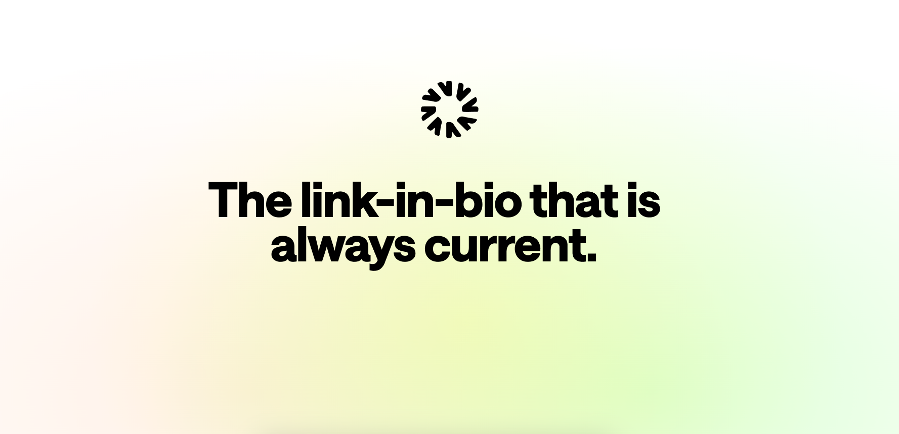

<h3 align="center">Linky</h3>

    An open-source dynamic personal page builder.
     
     
    <a href="#hello"><strong>Introduction</strong></a> ·
    <a href="#tech-stack"><strong>Tech Stack</strong></a> ·
    <a href="#self-hosting"><strong>Self-hosting</strong></a> ·
    <a href="#license"><strong>License</strong></a>

 

## Hello

Linky is an open-source dynamic personal page builder.

https://github.com/user-attachments/assets/d2c04b21-eb96-459b-8751-0c2bcb904da8

## Tech Stack

- [Next.js](https://nextjs.org/) – framework
- [TypeScript](https://www.typescriptlang.org/) – language
- [Tailwind](https://tailwindcss.com/) – CSS
- [NextAuth.js](https://next-auth.js.org/) – auth
- [Resend](https://resend.com/) – emails
- [Vercel](https://vercel.com/) – deployments

## Self-Hosting

You can self-host Linky if you would like to run it yourself.

- [Local Development](./docs/local-development.md)
- [Self-hosting](./docs/self-hosting.md)

## License

Please see the [LICENSE](https://github.com/tryglow/glow/blob/main/LICENSE) file for more information.
